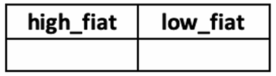

# Cryptocurrency Price Prediction

## Objective:

1. **Goal**: Predict the highest and lowest daily trading prices of a specific cryptocurrency, **Crypto A**, in a designated fiat currency (referred to as **FIAT X**).

2. **Data Provided**: You will receive 4 years of daily crypto trading pair data for Crypto A and FIAT X, including daily opening and closing prices, highest and lowest prices, and trading volume in the chosen fiat currency.

3. **Optional Data**: You can also provide trading pair data between Crypto A and another popular cryptocurrency, **Crypto B**.

4. **Predictive Model**: Create a model that accurately forecasts the daily highest and lowest prices of Crypto A traded in the currency **FIAT X** within the next **10-day period**. You can explore various methods, including traditional statistical approaches, modern machine learning algorithms, and neural networks.

5. **Evaluation**: Focus on the accuracy of your forecasts for the highest and lowest prices of Crypto A within the specified timeframe, without needing to pinpoint the exact day within these 10 days when these extreme prices will occur.

6. **Note**: Cryptocurrency trading pairs allow direct exchange between assets (e.g., Crypto A to Crypto B) without converting to a specific fiat currency (e.g., US dollars).

## Given:  
1. 51 months of data (2019-10-01 to 2024-02-29), with total of 1,613 observations
2. Low, High, Open, Close, Volume and Trading Volume traded at FIAT currency as well as Low, High, Open, Close, Volume, Trading Volume traded at Crypto Currency B as shown below.

## What You Have to Submit:

1. **CryptoA_10Day.csv**: Daily High/Low price “Close” of the Crypto A for the next 10 days (i.e., observation 1614 to 1623).

    

2. **High_Low.csv**: This file should contain only the values of the highest and lowest daily predicted prices extracted from the “high_fiat” and “low_fiat” columns in your CryptoA_10Day.csv. The name of this submitted CSV file must be High_Low.csv. The content should follow the format below.

    

3. **Python Code (ipynb)**: Your code notebook should include the following steps:
    - **Data Preparation**: Clean and pre-process the provided data to remove any inconsistencies or missing values.
    - **Feature Engineering**: Create a new feature set.
    - **Model Development**: Describe the algorithms and hyperparameters used, along with the model training and testing process.
    - **Model Scoring**: Forecast the daily high/low price of Crypto A traded in Fiat Currency, FIAT A. Generate the resulting data in a dataset named “CryptoA_10Day.csv” with three columns: “obs”, “high_fiat”, and “low_fiat”.

## Assessment Criteria:
The value from the “high_fiat” column and the “low_fiat” column in your submitted High_Low.csv dataset will be extracted. These values will be compared against the actual highest and lowest daily prices of the cryptocurrency that occurred in the predicted 10-day period. To evaluate the precision of your predictive model, we will employ the summation of the absolute error as the performance metric.

## Data Definition:
- obs: Sequence of observations  
- low(fiat): Lowest daily trading price of Crypto A in FIAT X currency  
- high(fiat): Highest daily trading price of Crypto A in FIAT X currency  
- open(fiat): Opening daily trading price of Crypto A in FIAT X currency   
- close(fiat): Closing daily trading price of Crypto A in FIAT X currency  
- vol (fiat): Trading volume of Crypto A in FIAT X currency  
- trade_vol(fiat): Computed as the closing price multiplied by the trading volume of Crypto A in FIAT X (close(fiat) * vol (fiat))  
- low(crypto): Lowest daily trading price of Crypto A in Crypto B currency  
- high(crypto): Highest daily trading price of Crypto A in Crypto B currency  
- open(crypto): Opening daily trading price of Crypto A in Crypto B currency  
- close(crypto): Closing daily trading price of Crypto A in Crypto B currency  
- vol(crypto): Trading volume of Crypto A in Crypto B  
- trade_vol(crypto): Calculated as the closing price times the trading volume of Crypto A in
Crypto B currency (close(crypto) * vol (crypto))