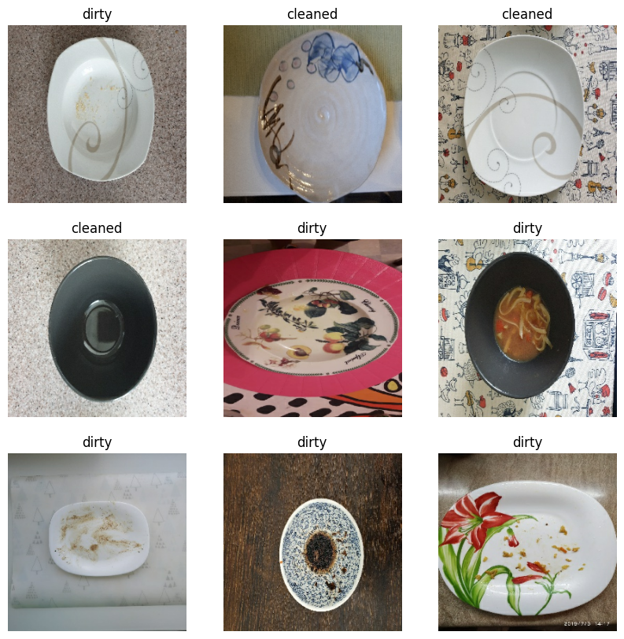
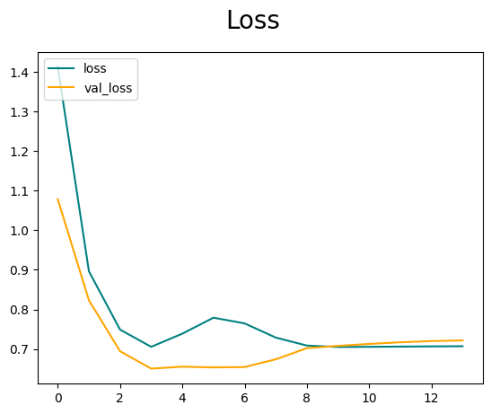
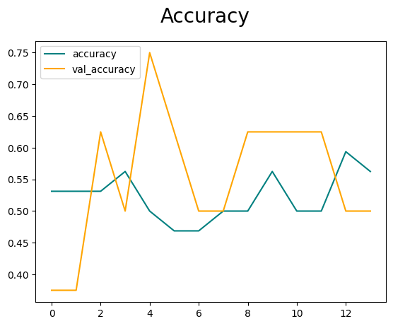
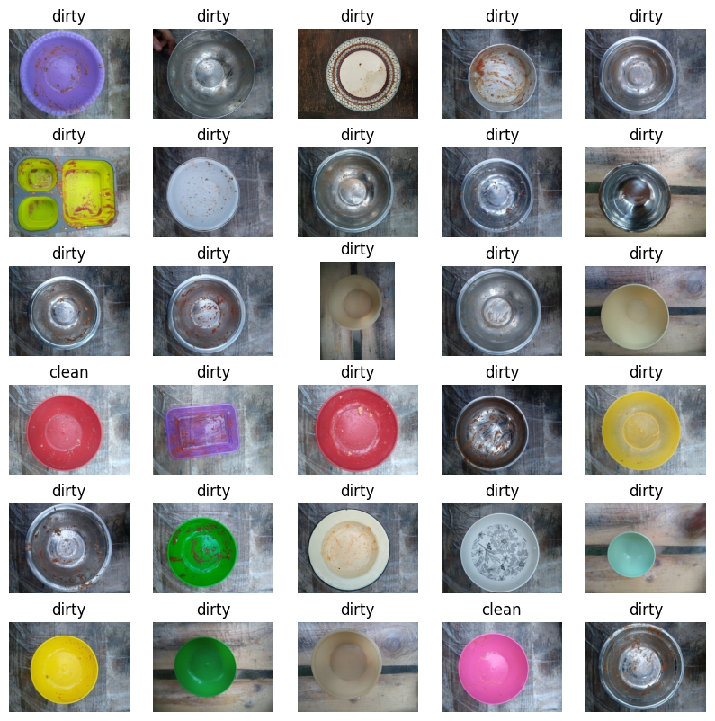

```python
# load libraries
import numpy as np
import pandas as pd
import matplotlib.pyplot as plt
import seaborn as sns
import tensorflow as tf
```

## Loading Dataset


```python
data_dir = 'data\\plates\\train'
```


```python
img_height = 256
img_width = 256
```


```python
train_ds = tf.keras.utils.image_dataset_from_directory(
  data_dir,
  validation_split=0.2,
  subset="training",
  seed=123,
  image_size=(img_height, img_width),
  )

val_ds = tf.keras.utils.image_dataset_from_directory(
  data_dir,
  validation_split=0.2,
  subset="validation",
  seed=123,
  image_size=(img_height, img_width),
  )
```

    Found 40 files belonging to 2 classes.
    Using 32 files for training.
    Found 40 files belonging to 2 classes.
    Using 8 files for validation.
    


```python
class_names = train_ds.class_names
print(class_names)
```

    ['cleaned', 'dirty']
    


```python
plt.figure(figsize=(10, 10))
for images, labels in train_ds.take(1):
  for i in range(9):
    ax = plt.subplot(3, 3, i + 1)
    plt.imshow(images[i].numpy().astype("uint8"))
    plt.title(class_names[labels[i]])
    plt.axis("off")
```


    

    


```python
for image_batch, labels_batch in train_ds:
  print(image_batch.shape)
  print(labels_batch.shape)
  break
```

    (32, 256, 256, 3)
    (32,)
    

### Configure the dataset for performance

Make sure to use buffered prefetching, so you can yield data from disk without having I/O become blocking. These are two important methods you should use when loading data:
- **Dataset.cache** keeps the images in memory after they're loaded off disk during the first epoch. This will ensure the dataset does not become a bottleneck while training your model. If your dataset is too large to fit into memory, you can also use this method to create a performant on-disk cache.
- **Dataset.prefetch** overlaps data preprocessing and model execution while training.


```python
AUTOTUNE = tf.data.AUTOTUNE

train_ds = train_ds.cache().shuffle(1000).prefetch(buffer_size=AUTOTUNE)
val_ds = val_ds.cache().prefetch(buffer_size=AUTOTUNE)
```

## Build Deep Learning Model


```python
from tensorflow.keras.models import Sequential
from tensorflow.keras.layers import Rescaling, RandomFlip, RandomRotation, RandomZoom, RandomContrast, RandomCrop, RandomTranslation, RandomHeight, RandomWidth, Conv2D, MaxPooling2D, GlobalAveragePooling2D, Dense

```


```python
model = Sequential()

# normalization layer
model.add(Rescaling(1./255, input_shape=(img_height, img_width, 3)))

# model architecture
model.add(Conv2D(16, 3, padding='same', activation='relu'))
model.add(MaxPooling2D())
model.add(Conv2D(32, 3, padding='same', activation='relu'))
model.add(MaxPooling2D())
model.add(Conv2D(64, 3, padding='same', activation='relu'))
model.add(MaxPooling2D())

# Use GlobalAveragePooling2D instead of Flatten
model.add(GlobalAveragePooling2D())

model.add(Dense(128, activation='relu'))
model.add(Dense(1))

```


```python
# Compile the model
model.compile(optimizer='adam',
              loss='binary_crossentropy',
              metrics=['accuracy'])
```


```python
model.summary()
```

    Model: "sequential_6"
    _________________________________________________________________
     Layer (type)                Output Shape              Param #   
    =================================================================
     rescaling_6 (Rescaling)     (None, 256, 256, 3)       0         
                                                                     
     conv2d_18 (Conv2D)          (None, 256, 256, 16)      448       
                                                                     
     max_pooling2d_18 (MaxPoolin  (None, 128, 128, 16)     0         
     g2D)                                                            
                                                                     
     conv2d_19 (Conv2D)          (None, 128, 128, 32)      4640      
                                                                     
     max_pooling2d_19 (MaxPoolin  (None, 64, 64, 32)       0         
     g2D)                                                            
                                                                     
     conv2d_20 (Conv2D)          (None, 64, 64, 64)        18496     
                                                                     
     max_pooling2d_20 (MaxPoolin  (None, 32, 32, 64)       0         
     g2D)                                                            
                                                                     
     global_average_pooling2d_1   (None, 64)               0         
     (GlobalAveragePooling2D)                                        
                                                                     
     dense_6 (Dense)             (None, 128)               8320      
                                                                     
     dense_7 (Dense)             (None, 1)                 129       
                                                                     
    =================================================================
    Total params: 32,033
    Trainable params: 32,033
    Non-trainable params: 0
    _________________________________________________________________
    

## Model training


```python
# Callbacks
from tensorflow.keras.callbacks import ModelCheckpoint, EarlyStopping, ReduceLROnPlateau
checkpoint = ModelCheckpoint("best_model.h5", monitor='val_accuracy', save_best_only=True)
early_stopping = EarlyStopping(monitor='val_loss', patience=10)
reduce_lr = ReduceLROnPlateau(monitor='val_loss', factor=0.2, patience=5)
```


```python
epochs=100
```


```python
# Train the model
hist = model.fit(train_ds, epochs=epochs, validation_data=val_ds, callbacks=[checkpoint, early_stopping, reduce_lr])
```

    Epoch 1/100
    1/1 [==============================] - 1s 1s/step - loss: 1.4121 - accuracy: 0.5312 - val_loss: 1.0779 - val_accuracy: 0.3750 - lr: 0.0010
    Epoch 2/100
    1/1 [==============================] - 0s 64ms/step - loss: 0.8961 - accuracy: 0.5312 - val_loss: 0.8231 - val_accuracy: 0.3750 - lr: 0.0010
    Epoch 3/100
    1/1 [==============================] - 0s 88ms/step - loss: 0.7490 - accuracy: 0.5312 - val_loss: 0.6944 - val_accuracy: 0.6250 - lr: 0.0010
    Epoch 4/100
    1/1 [==============================] - 0s 59ms/step - loss: 0.7056 - accuracy: 0.5625 - val_loss: 0.6506 - val_accuracy: 0.5000 - lr: 0.0010
    Epoch 5/100
    1/1 [==============================] - 0s 101ms/step - loss: 0.7388 - accuracy: 0.5000 - val_loss: 0.6555 - val_accuracy: 0.7500 - lr: 0.0010
    Epoch 6/100
    1/1 [==============================] - 0s 63ms/step - loss: 0.7791 - accuracy: 0.4688 - val_loss: 0.6537 - val_accuracy: 0.6250 - lr: 0.0010
    Epoch 7/100
    1/1 [==============================] - 0s 63ms/step - loss: 0.7647 - accuracy: 0.4688 - val_loss: 0.6545 - val_accuracy: 0.5000 - lr: 0.0010
    Epoch 8/100
    1/1 [==============================] - 0s 68ms/step - loss: 0.7290 - accuracy: 0.5000 - val_loss: 0.6741 - val_accuracy: 0.5000 - lr: 0.0010
    Epoch 9/100
    1/1 [==============================] - 0s 63ms/step - loss: 0.7088 - accuracy: 0.5000 - val_loss: 0.7022 - val_accuracy: 0.6250 - lr: 0.0010
    Epoch 10/100
    1/1 [==============================] - 0s 62ms/step - loss: 0.7052 - accuracy: 0.5625 - val_loss: 0.7080 - val_accuracy: 0.6250 - lr: 2.0000e-04
    Epoch 11/100
    1/1 [==============================] - 0s 66ms/step - loss: 0.7056 - accuracy: 0.5000 - val_loss: 0.7129 - val_accuracy: 0.6250 - lr: 2.0000e-04
    Epoch 12/100
    1/1 [==============================] - 0s 67ms/step - loss: 0.7062 - accuracy: 0.5000 - val_loss: 0.7171 - val_accuracy: 0.6250 - lr: 2.0000e-04
    Epoch 13/100
    1/1 [==============================] - 0s 71ms/step - loss: 0.7067 - accuracy: 0.5938 - val_loss: 0.7201 - val_accuracy: 0.5000 - lr: 2.0000e-04
    Epoch 14/100
    1/1 [==============================] - 0s 62ms/step - loss: 0.7071 - accuracy: 0.5625 - val_loss: 0.7219 - val_accuracy: 0.5000 - lr: 2.0000e-04
    

## Plot Performance


```python
fig = plt.figure()
plt.plot(hist.history['loss'], color='teal', label='loss')
plt.plot(hist.history['val_loss'], color='orange', label='val_loss')
fig.suptitle('Loss', fontsize=20)
plt.legend(loc="upper left")
plt.show()
```


    

    


```python
fig = plt.figure()
plt.plot(hist.history['accuracy'], color='teal', label='accuracy')
plt.plot(hist.history['val_accuracy'], color='orange', label='val_accuracy')
fig.suptitle('Accuracy', fontsize=20)
plt.legend(loc="upper left")
plt.show()
```


    

    


## Creating Submission


```python
test_dir = 'data\\plates\\test'
```


```python
# file names in the test directory
import os
test_files = os.listdir(test_dir)
print(test_files)
```

    ['0000.jpg', '0001.jpg', '0002.jpg', '0003.jpg', '0004.jpg', '0005.jpg', '0006.jpg', '0007.jpg', '0008.jpg', '0009.jpg', '0010.jpg', '0011.jpg', '0012.jpg', '0013.jpg', '0014.jpg', '0015.jpg', '0016.jpg', '0017.jpg', '0018.jpg', '0019.jpg', '0020.jpg', '0021.jpg', '0022.jpg', '0023.jpg', '0024.jpg', '0025.jpg', '0026.jpg', '0027.jpg', '0028.jpg', '0029.jpg', '0030.jpg', '0031.jpg', '0032.jpg', '0033.jpg', '0034.jpg', '0035.jpg', '0036.jpg', '0037.jpg', '0038.jpg', '0039.jpg', '0040.jpg', '0041.jpg', '0042.jpg', '0043.jpg', '0044.jpg', '0045.jpg', '0046.jpg', '0047.jpg', '0048.jpg', '0049.jpg', '0050.jpg', '0051.jpg', '0052.jpg', '0053.jpg', '0054.jpg', '0055.jpg', '0056.jpg', '0057.jpg', '0058.jpg', '0059.jpg', '0060.jpg', '0061.jpg', '0062.jpg', '0063.jpg', '0064.jpg', '0065.jpg', '0066.jpg', '0067.jpg', '0068.jpg', '0069.jpg', '0070.jpg', '0071.jpg', '0072.jpg', '0073.jpg', '0074.jpg', '0075.jpg', '0076.jpg', '0077.jpg', '0078.jpg', '0079.jpg', '0080.jpg', '0081.jpg', '0082.jpg', '0083.jpg', '0084.jpg', '0085.jpg', '0086.jpg', '0087.jpg', '0088.jpg', '0089.jpg', '0090.jpg', '0091.jpg', '0092.jpg', '0093.jpg', '0094.jpg', '0095.jpg', '0096.jpg', '0097.jpg', '0098.jpg', '0099.jpg', '0100.jpg', '0101.jpg', '0102.jpg', '0103.jpg', '0104.jpg', '0105.jpg', '0106.jpg', '0107.jpg', '0108.jpg', '0109.jpg', '0110.jpg', '0111.jpg', '0112.jpg', '0113.jpg', '0114.jpg', '0115.jpg', '0116.jpg', '0117.jpg', '0118.jpg', '0119.jpg', '0120.jpg', '0121.jpg', '0122.jpg', '0123.jpg', '0124.jpg', '0125.jpg', '0126.jpg', '0127.jpg', '0128.jpg', '0129.jpg', '0130.jpg', '0131.jpg', '0132.jpg', '0133.jpg', '0134.jpg', '0135.jpg', '0136.jpg', '0137.jpg', '0138.jpg', '0139.jpg', '0140.jpg', '0141.jpg', '0142.jpg', '0143.jpg', '0144.jpg', '0145.jpg', '0146.jpg', '0147.jpg', '0148.jpg', '0149.jpg', '0150.jpg', '0151.jpg', '0152.jpg', '0153.jpg', '0154.jpg', '0155.jpg', '0156.jpg', '0157.jpg', '0158.jpg', '0159.jpg', '0160.jpg', '0161.jpg', '0162.jpg', '0163.jpg', '0164.jpg', '0165.jpg', '0166.jpg', '0167.jpg', '0168.jpg', '0169.jpg', '0170.jpg', '0171.jpg', '0172.jpg', '0173.jpg', '0174.jpg', '0175.jpg', '0176.jpg', '0177.jpg', '0178.jpg', '0179.jpg', '0180.jpg', '0181.jpg', '0182.jpg', '0183.jpg', '0184.jpg', '0185.jpg', '0186.jpg', '0187.jpg', '0188.jpg', '0189.jpg', '0190.jpg', '0191.jpg', '0192.jpg', '0193.jpg', '0194.jpg', '0195.jpg', '0196.jpg', '0197.jpg', '0198.jpg', '0199.jpg', '0200.jpg', '0201.jpg', '0202.jpg', '0203.jpg', '0204.jpg', '0205.jpg', '0206.jpg', '0207.jpg', '0208.jpg', '0209.jpg', '0210.jpg', '0211.jpg', '0212.jpg', '0213.jpg', '0214.jpg', '0215.jpg', '0216.jpg', '0217.jpg', '0218.jpg', '0219.jpg', '0220.jpg', '0221.jpg', '0222.jpg', '0223.jpg', '0224.jpg', '0225.jpg', '0226.jpg', '0227.jpg', '0228.jpg', '0229.jpg', '0230.jpg', '0231.jpg', '0232.jpg', '0233.jpg', '0234.jpg', '0235.jpg', '0236.jpg', '0237.jpg', '0238.jpg', '0239.jpg', '0240.jpg', '0241.jpg', '0242.jpg', '0243.jpg', '0244.jpg', '0245.jpg', '0246.jpg', '0247.jpg', '0248.jpg', '0249.jpg', '0250.jpg', '0251.jpg', '0252.jpg', '0253.jpg', '0254.jpg', '0255.jpg', '0256.jpg', '0257.jpg', '0258.jpg', '0259.jpg', '0260.jpg', '0261.jpg', '0262.jpg', '0263.jpg', '0264.jpg', '0265.jpg', '0266.jpg', '0267.jpg', '0268.jpg', '0269.jpg', '0270.jpg', '0271.jpg', '0272.jpg', '0273.jpg', '0274.jpg', '0275.jpg', '0276.jpg', '0277.jpg', '0278.jpg', '0279.jpg', '0280.jpg', '0281.jpg', '0282.jpg', '0283.jpg', '0284.jpg', '0285.jpg', '0286.jpg', '0287.jpg', '0288.jpg', '0289.jpg', '0290.jpg', '0291.jpg', '0292.jpg', '0293.jpg', '0294.jpg', '0295.jpg', '0296.jpg', '0297.jpg', '0298.jpg', '0299.jpg', '0300.jpg', '0301.jpg', '0302.jpg', '0303.jpg', '0304.jpg', '0305.jpg', '0306.jpg', '0307.jpg', '0308.jpg', '0309.jpg', '0310.jpg', '0311.jpg', '0312.jpg', '0313.jpg', '0314.jpg', '0315.jpg', '0316.jpg', '0317.jpg', '0318.jpg', '0319.jpg', '0320.jpg', '0321.jpg', '0322.jpg', '0323.jpg', '0324.jpg', '0325.jpg', '0326.jpg', '0327.jpg', '0328.jpg', '0329.jpg', '0330.jpg', '0331.jpg', '0332.jpg', '0333.jpg', '0334.jpg', '0335.jpg', '0336.jpg', '0337.jpg', '0338.jpg', '0339.jpg', '0340.jpg', '0341.jpg', '0342.jpg', '0343.jpg', '0344.jpg', '0345.jpg', '0346.jpg', '0347.jpg', '0348.jpg', '0349.jpg', '0350.jpg', '0351.jpg', '0352.jpg', '0353.jpg', '0354.jpg', '0355.jpg', '0356.jpg', '0357.jpg', '0358.jpg', '0359.jpg', '0360.jpg', '0361.jpg', '0362.jpg', '0363.jpg', '0364.jpg', '0365.jpg', '0366.jpg', '0367.jpg', '0368.jpg', '0369.jpg', '0370.jpg', '0371.jpg', '0372.jpg', '0373.jpg', '0374.jpg', '0375.jpg', '0376.jpg', '0377.jpg', '0378.jpg', '0379.jpg', '0380.jpg', '0381.jpg', '0382.jpg', '0383.jpg', '0384.jpg', '0385.jpg', '0386.jpg', '0387.jpg', '0388.jpg', '0389.jpg', '0390.jpg', '0391.jpg', '0392.jpg', '0393.jpg', '0394.jpg', '0395.jpg', '0396.jpg', '0397.jpg', '0398.jpg', '0399.jpg', '0400.jpg', '0401.jpg', '0402.jpg', '0403.jpg', '0404.jpg', '0405.jpg', '0406.jpg', '0407.jpg', '0408.jpg', '0409.jpg', '0410.jpg', '0411.jpg', '0412.jpg', '0413.jpg', '0414.jpg', '0415.jpg', '0416.jpg', '0417.jpg', '0418.jpg', '0419.jpg', '0420.jpg', '0421.jpg', '0422.jpg', '0423.jpg', '0424.jpg', '0425.jpg', '0426.jpg', '0427.jpg', '0428.jpg', '0429.jpg', '0430.jpg', '0431.jpg', '0432.jpg', '0433.jpg', '0434.jpg', '0435.jpg', '0436.jpg', '0437.jpg', '0438.jpg', '0439.jpg', '0440.jpg', '0441.jpg', '0442.jpg', '0443.jpg', '0444.jpg', '0445.jpg', '0446.jpg', '0447.jpg', '0448.jpg', '0449.jpg', '0450.jpg', '0451.jpg', '0452.jpg', '0453.jpg', '0454.jpg', '0455.jpg', '0456.jpg', '0457.jpg', '0458.jpg', '0459.jpg', '0460.jpg', '0461.jpg', '0462.jpg', '0463.jpg', '0464.jpg', '0465.jpg', '0466.jpg', '0467.jpg', '0468.jpg', '0469.jpg', '0470.jpg', '0471.jpg', '0472.jpg', '0473.jpg', '0474.jpg', '0475.jpg', '0476.jpg', '0477.jpg', '0478.jpg', '0479.jpg', '0480.jpg', '0481.jpg', '0482.jpg', '0483.jpg', '0484.jpg', '0485.jpg', '0486.jpg', '0487.jpg', '0488.jpg', '0489.jpg', '0490.jpg', '0491.jpg', '0492.jpg', '0493.jpg', '0494.jpg', '0495.jpg', '0496.jpg', '0497.jpg', '0498.jpg', '0499.jpg', '0500.jpg', '0501.jpg', '0502.jpg', '0503.jpg', '0504.jpg', '0505.jpg', '0506.jpg', '0507.jpg', '0508.jpg', '0509.jpg', '0510.jpg', '0511.jpg', '0512.jpg', '0513.jpg', '0514.jpg', '0515.jpg', '0516.jpg', '0517.jpg', '0518.jpg', '0519.jpg', '0520.jpg', '0521.jpg', '0522.jpg', '0523.jpg', '0524.jpg', '0525.jpg', '0526.jpg', '0527.jpg', '0528.jpg', '0529.jpg', '0530.jpg', '0531.jpg', '0532.jpg', '0533.jpg', '0534.jpg', '0535.jpg', '0536.jpg', '0537.jpg', '0538.jpg', '0539.jpg', '0540.jpg', '0541.jpg', '0542.jpg', '0543.jpg', '0544.jpg', '0545.jpg', '0546.jpg', '0547.jpg', '0548.jpg', '0549.jpg', '0550.jpg', '0551.jpg', '0552.jpg', '0553.jpg', '0554.jpg', '0555.jpg', '0556.jpg', '0557.jpg', '0558.jpg', '0559.jpg', '0560.jpg', '0561.jpg', '0562.jpg', '0563.jpg', '0564.jpg', '0565.jpg', '0566.jpg', '0567.jpg', '0568.jpg', '0569.jpg', '0570.jpg', '0571.jpg', '0572.jpg', '0573.jpg', '0574.jpg', '0575.jpg', '0576.jpg', '0577.jpg', '0578.jpg', '0579.jpg', '0580.jpg', '0581.jpg', '0582.jpg', '0583.jpg', '0584.jpg', '0585.jpg', '0586.jpg', '0587.jpg', '0588.jpg', '0589.jpg', '0590.jpg', '0591.jpg', '0592.jpg', '0593.jpg', '0594.jpg', '0595.jpg', '0596.jpg', '0597.jpg', '0598.jpg', '0599.jpg', '0600.jpg', '0601.jpg', '0602.jpg', '0603.jpg', '0604.jpg', '0605.jpg', '0606.jpg', '0607.jpg', '0608.jpg', '0609.jpg', '0610.jpg', '0611.jpg', '0612.jpg', '0613.jpg', '0614.jpg', '0615.jpg', '0616.jpg', '0617.jpg', '0618.jpg', '0619.jpg', '0620.jpg', '0621.jpg', '0622.jpg', '0623.jpg', '0624.jpg', '0625.jpg', '0626.jpg', '0627.jpg', '0628.jpg', '0629.jpg', '0630.jpg', '0631.jpg', '0632.jpg', '0633.jpg', '0634.jpg', '0635.jpg', '0636.jpg', '0637.jpg', '0638.jpg', '0639.jpg', '0640.jpg', '0641.jpg', '0642.jpg', '0643.jpg', '0644.jpg', '0645.jpg', '0646.jpg', '0647.jpg', '0648.jpg', '0649.jpg', '0650.jpg', '0651.jpg', '0652.jpg', '0653.jpg', '0654.jpg', '0655.jpg', '0656.jpg', '0657.jpg', '0658.jpg', '0659.jpg', '0660.jpg', '0661.jpg', '0662.jpg', '0663.jpg', '0664.jpg', '0665.jpg', '0666.jpg', '0667.jpg', '0668.jpg', '0669.jpg', '0670.jpg', '0671.jpg', '0672.jpg', '0673.jpg', '0674.jpg', '0675.jpg', '0676.jpg', '0677.jpg', '0678.jpg', '0679.jpg', '0680.jpg', '0681.jpg', '0682.jpg', '0683.jpg', '0684.jpg', '0685.jpg', '0686.jpg', '0687.jpg', '0688.jpg', '0689.jpg', '0690.jpg', '0691.jpg', '0692.jpg', '0693.jpg', '0694.jpg', '0695.jpg', '0696.jpg', '0697.jpg', '0698.jpg', '0699.jpg', '0700.jpg', '0701.jpg', '0702.jpg', '0703.jpg', '0704.jpg', '0705.jpg', '0706.jpg', '0707.jpg', '0708.jpg', '0709.jpg', '0710.jpg', '0711.jpg', '0712.jpg', '0713.jpg', '0714.jpg', '0715.jpg', '0716.jpg', '0717.jpg', '0718.jpg', '0719.jpg', '0720.jpg', '0721.jpg', '0722.jpg', '0723.jpg', '0724.jpg', '0725.jpg', '0726.jpg', '0727.jpg', '0728.jpg', '0729.jpg', '0730.jpg', '0731.jpg', '0732.jpg', '0733.jpg', '0734.jpg', '0735.jpg', '0736.jpg', '0737.jpg', '0738.jpg', '0739.jpg', '0740.jpg', '0741.jpg', '0742.jpg', '0743.jpg']
    


```python
# file formats in the test directory
test_formats = [f.split('.')[-1] for f in test_files]
print(np.unique(test_formats))
```

    ['jpg']
    


```python
# Load the test data without expecting labels
test_ds = tf.keras.utils.image_dataset_from_directory(
    test_dir,
    image_size=(img_height, img_width),
    labels='inferred',  # Set to 'inferred' since we don't have labels
    label_mode=None,  # No labels, so set mode to None
    color_mode='rgb',  # Assuming RGB images
    shuffle=False  # No need to shuffle test data
)
```

    Found 744 files belonging to 1 classes.
    


```python
# Predict the test data
predictions = model.predict(test_ds)
print(predictions)
```

    19/19 [==============================] - 1s 34ms/step
    [[0.4182915 ]
     [0.33350033]
     [0.3637507 ]
     [0.3659541 ]
     [0.39452952]
     [0.39712378]
     [0.40869126]
     [0.3502968 ]
     [0.37215465]
     [0.4203996 ]
     [0.36957347]
     [0.39817354]
     [0.32227865]
     [0.3694226 ]
     [0.39881685]
     [0.50330657]
     [0.47581682]
     [0.49764118]
     [0.31939217]
     [0.43760037]
     [0.36983714]
     [0.37620518]
     [0.4628452 ]
     [0.4138177 ]
     [0.43271777]
     [0.38352764]
     [0.33331764]
     [0.42293772]
     [0.51109165]
     [0.36195117]
     [0.40682587]
     [0.45351863]
     [0.393608  ]
     [0.35543618]
     [0.36553752]
     [0.3532297 ]
     [0.46165827]
     [0.4229239 ]
     [0.36324298]
     [0.3617455 ]
     [0.32637662]
     [0.36640564]
     [0.34064263]
     [0.35416558]
     [0.3847977 ]
     [0.38139635]
     [0.37567863]
     [0.4152331 ]
     [0.39756846]
     [0.38240117]
     [0.33915487]
     [0.3503798 ]
     [0.4446481 ]
     [0.3990578 ]
     [0.31261182]
     [0.3123461 ]
     [0.3671269 ]
     [0.36745536]
     [0.30963096]
     [0.45312726]
     [0.3857015 ]
     [0.34027365]
     [0.41689092]
     [0.34996852]
     [0.3581681 ]
     [0.36196783]
     [0.2455498 ]
     [0.37596124]
     [0.40517107]
     [0.36274165]
     [0.37368914]
     [0.3482291 ]
     [0.44802123]
     [0.32782254]
     [0.36511105]
     [0.42861906]
     [0.37839112]
     [0.47539446]
     [0.480407  ]
     [0.38332117]
     [0.3693374 ]
     [0.3391315 ]
     [0.40285102]
     [0.30835888]
     [0.4333862 ]
     [0.485625  ]
     [0.35079968]
     [0.383833  ]
     [0.34736663]
     [0.34751332]
     [0.43390173]
     [0.38593143]
     [0.41744024]
     [0.44035184]
     [0.47120917]
     [0.39546978]
     [0.476022  ]
     [0.26400486]
     [0.3897416 ]
     [0.31660777]
     [0.36479345]
     [0.36621162]
     [0.35749108]
     [0.36142766]
     [0.39474803]
     [0.46389908]
     [0.44292572]
     [0.2661329 ]
     [0.45103627]
     [0.40568197]
     [0.4211757 ]
     [0.487094  ]
     [0.3851284 ]
     [0.3621956 ]
     [0.41032043]
     [0.37293884]
     [0.4027003 ]
     [0.32756323]
     [0.3704336 ]
     [0.2448813 ]
     [0.489842  ]
     [0.42035988]
     [0.367889  ]
     [0.39804843]
     [0.4120307 ]
     [0.39481702]
     [0.34917173]
     [0.39034525]
     [0.45330957]
     [0.349518  ]
     [0.38016325]
     [0.273846  ]
     [0.448941  ]
     [0.37139934]
     [0.3625252 ]
     [0.3582226 ]
     [0.37132153]
     [0.38749665]
     [0.36957175]
     [0.33515996]
     [0.337501  ]
     [0.35139406]
     [0.48076418]
     [0.3826356 ]
     [0.36710265]
     [0.3560689 ]
     [0.35757953]
     [0.31240472]
     [0.39145166]
     [0.41426152]
     [0.3708832 ]
     [0.3347392 ]
     [0.42317554]
     [0.4320811 ]
     [0.37418342]
     [0.4507791 ]
     [0.38878578]
     [0.44305086]
     [0.4189942 ]
     [0.3672152 ]
     [0.38664126]
     [0.47516435]
     [0.33801475]
     [0.36042804]
     [0.42024624]
     [0.38749138]
     [0.41344562]
     [0.40704566]
     [0.37053013]
     [0.36159116]
     [0.3770448 ]
     [0.37622184]
     [0.36547038]
     [0.33914787]
     [0.35181412]
     [0.41244528]
     [0.35781947]
     [0.3530739 ]
     [0.3862522 ]
     [0.27515864]
     [0.35562018]
     [0.3660277 ]
     [0.43616295]
     [0.27878034]
     [0.48292074]
     [0.41772458]
     [0.4470192 ]
     [0.3950626 ]
     [0.3696862 ]
     [0.44803858]
     [0.3651665 ]
     [0.37843558]
     [0.46879178]
     [0.3731359 ]
     [0.45324782]
     [0.43083638]
     [0.42744827]
     [0.4502287 ]
     [0.36730012]
     [0.38265345]
     [0.40677252]
     [0.31082895]
     [0.42512676]
     [0.4223033 ]
     [0.41108128]
     [0.44114953]
     [0.4901696 ]
     [0.46782225]
     [0.36544734]
     [0.43198377]
     [0.42507327]
     [0.34740105]
     [0.34346664]
     [0.31268024]
     [0.33283287]
     [0.36963397]
     [0.3535585 ]
     [0.42741612]
     [0.46929416]
     [0.34755412]
     [0.3023435 ]
     [0.35823184]
     [0.36870974]
     [0.35449144]
     [0.37778032]
     [0.33963916]
     [0.37628415]
     [0.3541482 ]
     [0.41456994]
     [0.24381898]
     [0.4199024 ]
     [0.43275782]
     [0.3663153 ]
     [0.35752323]
     [0.36476988]
     [0.47626233]
     [0.37950158]
     [0.395729  ]
     [0.37821174]
     [0.4718837 ]
     [0.35592723]
     [0.47544277]
     [0.40429246]
     [0.4160373 ]
     [0.35617396]
     [0.37351352]
     [0.3487069 ]
     [0.38522026]
     [0.4780461 ]
     [0.3154577 ]
     [0.40013713]
     [0.36450186]
     [0.46726787]
     [0.44715697]
     [0.46748078]
     [0.37086493]
     [0.42494568]
     [0.36238244]
     [0.4612631 ]
     [0.31877878]
     [0.40114257]
     [0.39834115]
     [0.41905472]
     [0.3778651 ]
     [0.51732546]
     [0.3916343 ]
     [0.35670155]
     [0.43306684]
     [0.34585842]
     [0.37705892]
     [0.44878358]
     [0.39760363]
     [0.36969775]
     [0.418294  ]
     [0.42352355]
     [0.3650801 ]
     [0.34978777]
     [0.41989386]
     [0.42510092]
     [0.4733465 ]
     [0.37920848]
     [0.3477345 ]
     [0.37589395]
     [0.3436337 ]
     [0.41866642]
     [0.3582215 ]
     [0.27374515]
     [0.41750976]
     [0.40781263]
     [0.39165714]
     [0.3524124 ]
     [0.39855218]
     [0.386036  ]
     [0.36088976]
     [0.25321037]
     [0.3731197 ]
     [0.4236618 ]
     [0.31047377]
     [0.3602458 ]
     [0.4572133 ]
     [0.3877741 ]
     [0.31737095]
     [0.46709657]
     [0.39954746]
     [0.47977048]
     [0.36844212]
     [0.3812497 ]
     [0.41222218]
     [0.36100388]
     [0.31523985]
     [0.3550327 ]
     [0.49958777]
     [0.38540882]
     [0.42432928]
     [0.3528547 ]
     [0.3766065 ]
     [0.3621907 ]
     [0.39928848]
     [0.44011533]
     [0.39093718]
     [0.3496434 ]
     [0.33691117]
     [0.42844322]
     [0.34547544]
     [0.24390642]
     [0.46838835]
     [0.35216582]
     [0.33278534]
     [0.3822065 ]
     [0.43532014]
     [0.4459747 ]
     [0.3648114 ]
     [0.3590205 ]
     [0.40151563]
     [0.36901668]
     [0.48122826]
     [0.3358079 ]
     [0.39567643]
     [0.4146576 ]
     [0.35475528]
     [0.3713933 ]
     [0.42987743]
     [0.4549751 ]
     [0.46523902]
     [0.41503426]
     [0.48600775]
     [0.29923072]
     [0.4042302 ]
     [0.47310537]
     [0.31093597]
     [0.3872233 ]
     [0.40396523]
     [0.38335273]
     [0.4371734 ]
     [0.32411435]
     [0.36937785]
     [0.28954607]
     [0.37612832]
     [0.3702207 ]
     [0.4706028 ]
     [0.38218948]
     [0.38055694]
     [0.40823358]
     [0.45368704]
     [0.45915893]
     [0.36465862]
     [0.3685282 ]
     [0.3540034 ]
     [0.3592176 ]
     [0.4692776 ]
     [0.36810952]
     [0.3712538 ]
     [0.3896414 ]
     [0.4926108 ]
     [0.36886796]
     [0.33106735]
     [0.36742482]
     [0.4747731 ]
     [0.55599105]
     [0.38632342]
     [0.31704706]
     [0.4586249 ]
     [0.33352682]
     [0.34497315]
     [0.47643784]
     [0.41187927]
     [0.34219223]
     [0.24365169]
     [0.36959058]
     [0.42535812]
     [0.3913541 ]
     [0.4486808 ]
     [0.30610523]
     [0.40251333]
     [0.44615424]
     [0.40280962]
     [0.34630257]
     [0.3599551 ]
     [0.47490188]
     [0.3714293 ]
     [0.3598375 ]
     [0.32027575]
     [0.3668012 ]
     [0.36188933]
     [0.38300967]
     [0.40096882]
     [0.49609607]
     [0.29376134]
     [0.50142175]
     [0.4050064 ]
     [0.3832632 ]
     [0.34306237]
     [0.4862833 ]
     [0.38316318]
     [0.41996238]
     [0.45855507]
     [0.34316885]
     [0.3809979 ]
     [0.406531  ]
     [0.39281023]
     [0.49175912]
     [0.48679847]
     [0.36727098]
     [0.43608624]
     [0.37067717]
     [0.3483495 ]
     [0.37080958]
     [0.39144027]
     [0.3961471 ]
     [0.364874  ]
     [0.39311886]
     [0.41449213]
     [0.36740357]
     [0.40279046]
     [0.48028564]
     [0.41804183]
     [0.33463517]
     [0.4375624 ]
     [0.4009723 ]
     [0.346827  ]
     [0.31966078]
     [0.36393294]
     [0.4284705 ]
     [0.5004212 ]
     [0.38818488]
     [0.41310704]
     [0.37748152]
     [0.3308059 ]
     [0.36633426]
     [0.37839058]
     [0.43787423]
     [0.33130464]
     [0.46210465]
     [0.34514362]
     [0.35117698]
     [0.45929047]
     [0.4874189 ]
     [0.363335  ]
     [0.3560603 ]
     [0.3543402 ]
     [0.42703128]
     [0.30577746]
     [0.35232374]
     [0.44335786]
     [0.43936104]
     [0.46436882]
     [0.42227274]
     [0.31167027]
     [0.45879418]
     [0.24167402]
     [0.45005965]
     [0.41420063]
     [0.34894246]
     [0.37802714]
     [0.40496916]
     [0.27583238]
     [0.486934  ]
     [0.4175511 ]
     [0.38546696]
     [0.3730627 ]
     [0.36066762]
     [0.3860242 ]
     [0.3478926 ]
     [0.46722442]
     [0.39304018]
     [0.44167373]
     [0.38229644]
     [0.28723267]
     [0.4680231 ]
     [0.3414601 ]
     [0.3473062 ]
     [0.34600297]
     [0.3231272 ]
     [0.34727785]
     [0.37865132]
     [0.4420972 ]
     [0.3701707 ]
     [0.42966062]
     [0.4236109 ]
     [0.3877585 ]
     [0.3670347 ]
     [0.35987732]
     [0.4321688 ]
     [0.42416698]
     [0.4976397 ]
     [0.46472234]
     [0.5289527 ]
     [0.3294416 ]
     [0.44382682]
     [0.36870748]
     [0.38988099]
     [0.29732266]
     [0.3632545 ]
     [0.38062721]
     [0.445594  ]
     [0.35415635]
     [0.47561976]
     [0.47561187]
     [0.4810774 ]
     [0.33392045]
     [0.3432799 ]
     [0.36521316]
     [0.39771953]
     [0.3929511 ]
     [0.43770233]
     [0.398173  ]
     [0.3633454 ]
     [0.3694491 ]
     [0.46257505]
     [0.42069075]
     [0.24417953]
     [0.50634205]
     [0.37326485]
     [0.48425063]
     [0.3111768 ]
     [0.3973267 ]
     [0.2181352 ]
     [0.38368037]
     [0.37955368]
     [0.33159715]
     [0.4857589 ]
     [0.38594425]
     [0.39384356]
     [0.4165206 ]
     [0.37115434]
     [0.28005445]
     [0.4452212 ]
     [0.47652   ]
     [0.30035108]
     [0.30668783]
     [0.40139556]
     [0.32266656]
     [0.35211724]
     [0.4506505 ]
     [0.39843637]
     [0.40081078]
     [0.3430489 ]
     [0.403486  ]
     [0.42278838]
     [0.40072984]
     [0.36697426]
     [0.3981068 ]
     [0.47659326]
     [0.4000581 ]
     [0.40806675]
     [0.5036922 ]
     [0.36784074]
     [0.33859187]
     [0.45464823]
     [0.3032783 ]
     [0.36206025]
     [0.44758913]
     [0.3808936 ]
     [0.4089263 ]
     [0.42050666]
     [0.38019592]
     [0.37179437]
     [0.36036924]
     [0.36034137]
     [0.5079644 ]
     [0.3817428 ]
     [0.38089558]
     [0.38170183]
     [0.38803947]
     [0.36765316]
     [0.37194014]
     [0.47232062]
     [0.40266517]
     [0.34755152]
     [0.38757318]
     [0.4577079 ]
     [0.32593083]
     [0.35413286]
     [0.38137758]
     [0.35207817]
     [0.46204463]
     [0.37479976]
     [0.362165  ]
     [0.44573885]
     [0.31191492]
     [0.35212624]
     [0.3411393 ]
     [0.38608015]
     [0.3892114 ]
     [0.39157608]
     [0.3944768 ]
     [0.35109514]
     [0.36362928]
     [0.37035385]
     [0.3578569 ]
     [0.46731135]
     [0.4063966 ]
     [0.3586971 ]
     [0.4833629 ]
     [0.39039862]
     [0.36441526]
     [0.35837838]
     [0.39990774]
     [0.5436266 ]
     [0.35322195]
     [0.39202255]
     [0.3947121 ]
     [0.3572654 ]
     [0.47116694]
     [0.3658053 ]
     [0.34529752]
     [0.41614246]
     [0.23085554]
     [0.47055227]
     [0.39457947]
     [0.4779414 ]
     [0.40052733]
     [0.45878342]
     [0.3348673 ]
     [0.35065213]
     [0.35405484]
     [0.39265722]
     [0.46528015]
     [0.47449678]
     [0.42453235]
     [0.4067092 ]
     [0.4238646 ]
     [0.36909735]
     [0.38177282]
     [0.3578824 ]
     [0.44096068]
     [0.37348276]
     [0.51767486]
     [0.45272785]
     [0.44576213]
     [0.32455745]
     [0.37860307]
     [0.45032293]
     [0.27764815]
     [0.44982728]
     [0.3393534 ]
     [0.34268785]
     [0.42232317]
     [0.33471164]
     [0.46776482]
     [0.46329394]
     [0.3610248 ]
     [0.359283  ]
     [0.45298055]
     [0.40233198]
     [0.37908956]
     [0.33787414]
     [0.33230335]
     [0.503234  ]
     [0.46927455]
     [0.3870163 ]
     [0.4416765 ]
     [0.37513438]
     [0.43701476]
     [0.36917448]
     [0.3315949 ]
     [0.3573028 ]
     [0.47166604]
     [0.40112773]
     [0.3650373 ]
     [0.38932645]
     [0.36320025]
     [0.3762468 ]
     [0.34653407]
     [0.43639466]
     [0.48183137]
     [0.42469037]
     [0.39398557]
     [0.41656795]
     [0.3804875 ]
     [0.42132917]
     [0.40168333]
     [0.37491047]
     [0.3578475 ]
     [0.32974684]
     [0.38151908]
     [0.38723844]
     [0.36647558]
     [0.38449427]
     [0.3881462 ]
     [0.43435976]
     [0.28421766]
     [0.37812796]
     [0.36655754]
     [0.36290133]
     [0.19807912]
     [0.37872326]
     [0.39979723]
     [0.29026398]
     [0.3893039 ]
     [0.3479734 ]
     [0.36493352]
     [0.34791762]
     [0.39525235]
     [0.3386628 ]
     [0.42261928]
     [0.31678092]
     [0.36546594]
     [0.46259055]
     [0.37481022]
     [0.2989311 ]
     [0.35046023]
     [0.43680924]
     [0.3455293 ]
     [0.40144712]
     [0.37100488]
     [0.3819671 ]
     [0.46373388]
     [0.35876957]
     [0.46291828]
     [0.47284555]
     [0.3952173 ]
     [0.46979135]
     [0.3813106 ]
     [0.34552896]
     [0.4274821 ]
     [0.39032027]
     [0.33032033]
     [0.37779546]
     [0.34725904]
     [0.35306183]
     [0.2967795 ]
     [0.32071215]
     [0.34353384]]
    


```python
# Get the predicted class: 0 or 1
predicted_classes = (predictions > 0.5).astype("int32") # Convert boolean to 0 or 1
predicted_classes = predicted_classes.flatten() # Flatten to get a 1D array
print(predicted_classes)
```

    [0 0 0 0 0 0 0 0 0 0 0 0 0 0 0 1 0 0 0 0 0 0 0 0 0 0 0 0 1 0 0 0 0 0 0 0 0
     0 0 0 0 0 0 0 0 0 0 0 0 0 0 0 0 0 0 0 0 0 0 0 0 0 0 0 0 0 0 0 0 0 0 0 0 0
     0 0 0 0 0 0 0 0 0 0 0 0 0 0 0 0 0 0 0 0 0 0 0 0 0 0 0 0 0 0 0 0 0 0 0 0 0
     0 0 0 0 0 0 0 0 0 0 0 0 0 0 0 0 0 0 0 0 0 0 0 0 0 0 0 0 0 0 0 0 0 0 0 0 0
     0 0 0 0 0 0 0 0 0 0 0 0 0 0 0 0 0 0 0 0 0 0 0 0 0 0 0 0 0 0 0 0 0 0 0 0 0
     0 0 0 0 0 0 0 0 0 0 0 0 0 0 0 0 0 0 0 0 0 0 0 0 0 0 0 0 0 0 0 0 0 0 0 0 0
     0 0 0 0 0 0 0 0 0 0 0 0 0 0 0 0 0 0 0 0 0 0 0 0 0 0 0 0 0 0 0 0 0 0 0 0 0
     0 0 0 0 0 1 0 0 0 0 0 0 0 0 0 0 0 0 0 0 0 0 0 0 0 0 0 0 0 0 0 0 0 0 0 0 0
     0 0 0 0 0 0 0 0 0 0 0 0 0 0 0 0 0 0 0 0 0 0 0 0 0 0 0 0 0 0 0 0 0 0 0 0 0
     0 0 0 0 0 0 0 0 0 0 0 0 0 0 0 0 0 0 0 0 0 0 0 0 0 0 0 0 0 0 0 0 0 0 0 0 0
     0 0 0 0 0 0 0 0 1 0 0 0 0 0 0 0 0 0 0 0 0 0 0 0 0 0 0 0 0 0 0 0 0 0 0 0 0
     0 1 0 0 0 0 0 0 0 0 0 0 0 0 0 0 0 0 0 0 0 0 0 0 0 0 0 0 0 0 0 0 0 0 0 0 1
     0 0 0 0 0 0 0 0 0 0 0 0 0 0 0 0 0 0 0 0 0 0 0 0 0 0 0 0 0 0 0 0 0 0 0 0 0
     0 0 0 0 0 0 0 0 0 0 0 0 0 0 0 0 0 0 0 0 0 0 0 0 0 1 0 0 0 0 0 0 0 0 0 0 0
     0 0 0 0 0 0 0 0 0 0 0 0 0 1 0 0 0 0 0 0 0 0 0 0 0 0 0 0 0 0 0 0 0 0 0 0 0
     0 0 0 0 0 0 0 0 0 0 1 0 0 0 0 0 0 0 0 0 0 0 0 0 1 0 0 0 0 0 0 0 0 0 0 0 0
     0 0 0 0 0 0 0 0 0 0 0 0 0 0 0 0 0 0 0 0 0 0 0 0 0 0 1 0 0 0 0 0 0 0 0 0 0
     0 0 0 0 0 0 0 0 0 0 0 0 0 0 0 0 0 0 1 0 0 0 0 0 0 0 0 0 0 0 0 0 0 0 0 0 0
     0 0 1 0 0 0 0 0 0 0 0 0 0 0 0 0 0 0 0 0 0 0 0 0 0 0 0 0 0 0 0 0 0 0 0 0 0
     0 0 0 0 0 0 0 0 0 0 0 0 0 0 0 0 0 0 0 0 0 0 0 0 0 0 0 0 0 0 0 0 0 0 0 0 0
     0 0 0 0]
    


```python
# create a dataframe with filenames and predictions
df = pd.DataFrame({
    'id': [x.split('.')[0] for x in test_files],
    'label': ['clean' if p == 1 else 'dirty' for p in predicted_classes]
})
df.head()
```


<div>
<style scoped>
    .dataframe tbody tr th:only-of-type {
        vertical-align: middle;
    }

    .dataframe tbody tr th {
        vertical-align: top;
    }

    .dataframe thead th {
        text-align: right;
    }
</style>
<table border="1" class="dataframe">
  <thead>
    <tr style="text-align: right;">
      <th></th>
      <th>id</th>
      <th>label</th>
    </tr>
  </thead>
  <tbody>
    <tr>
      <th>0</th>
      <td>0000</td>
      <td>dirty</td>
    </tr>
    <tr>
      <th>1</th>
      <td>0001</td>
      <td>dirty</td>
    </tr>
    <tr>
      <th>2</th>
      <td>0002</td>
      <td>dirty</td>
    </tr>
    <tr>
      <th>3</th>
      <td>0003</td>
      <td>dirty</td>
    </tr>
    <tr>
      <th>4</th>
      <td>0004</td>
      <td>dirty</td>
    </tr>
  </tbody>
</table>
</div>


```python
df.to_csv('predictions.csv', index=False)
```


```python
# plot 30 predictions images and their labels
plt.figure(figsize=(10, 10))
for i in range(30):
    ax = plt.subplot(6, 5, i + 1)
    plt.imshow(tf.keras.preprocessing.image.load_img(
        os.path.join(test_dir, test_files[i])
    ))
    plt.title(df['label'][i])
    plt.axis("off")
plt.show()

```


    

    


```python
# save this jupyter notebook as a markdown file
!jupyter nbconvert plates.ipynb --to markdown --output plates.md
```
